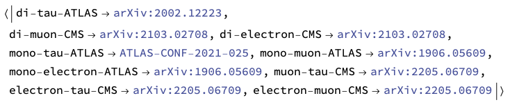
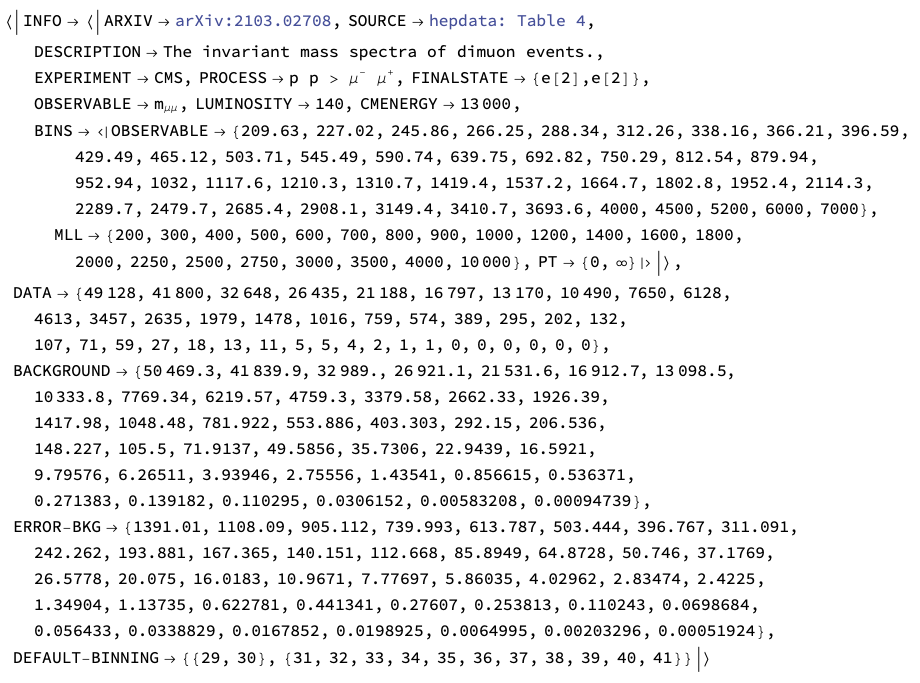
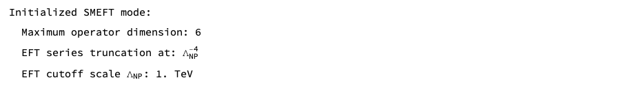
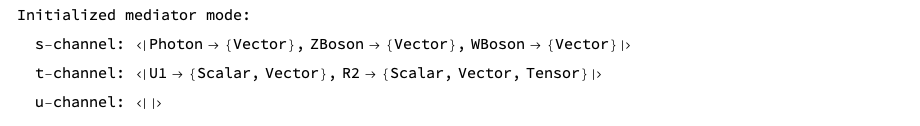
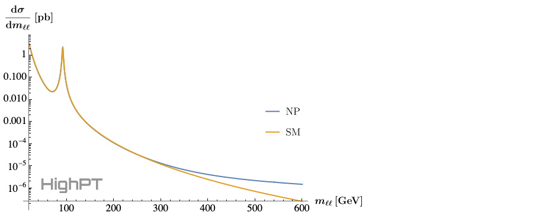
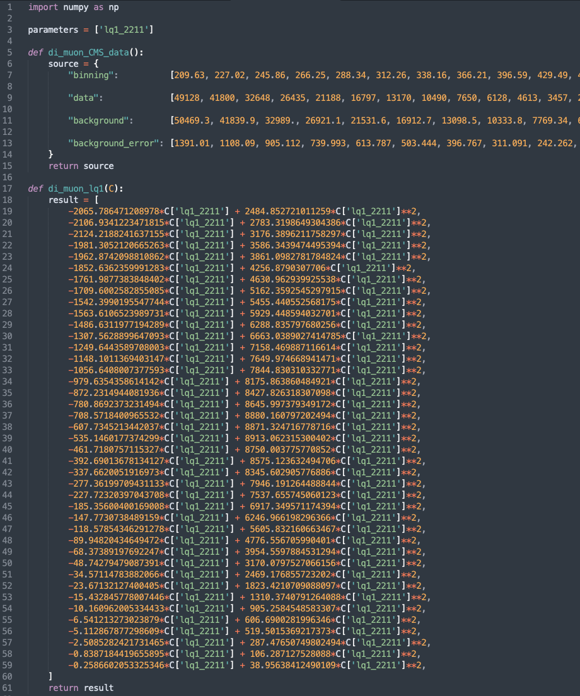
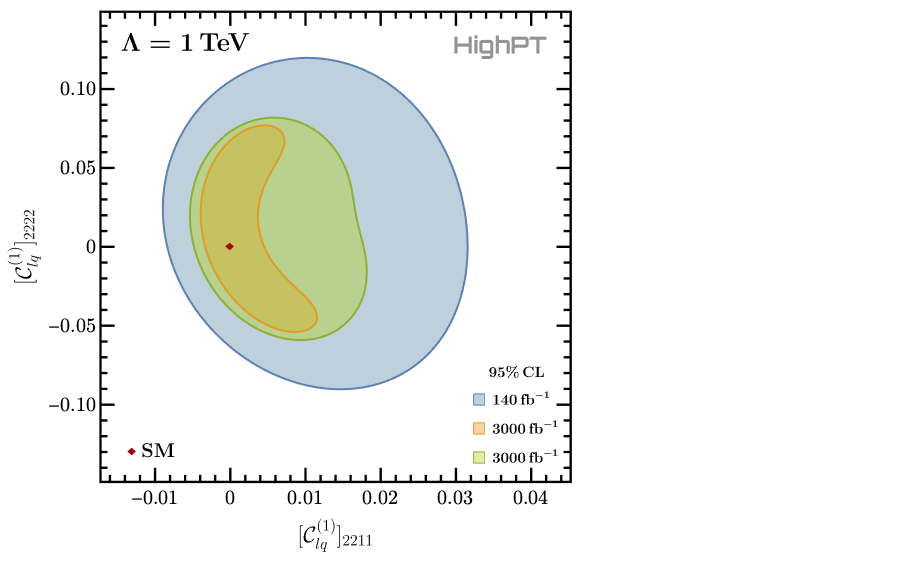
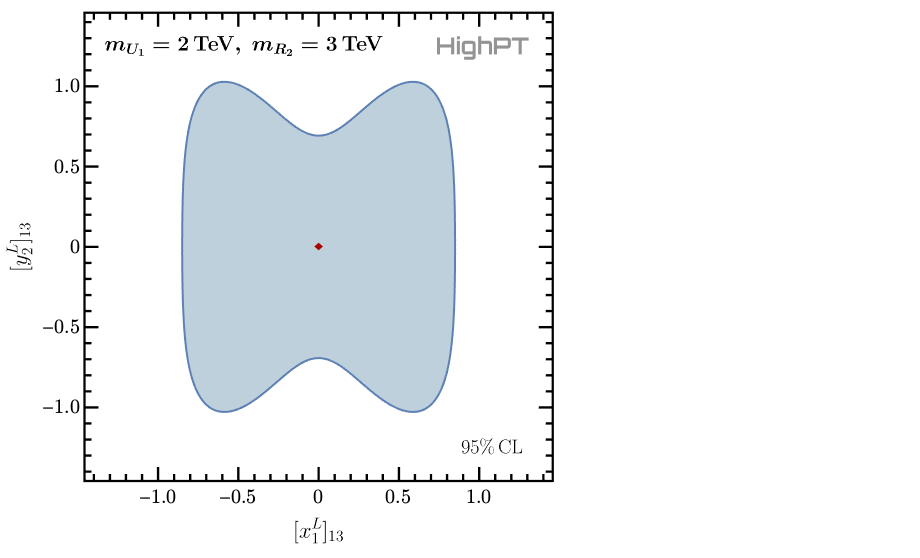

# Documentation of `HighPT`

The online documentation refers to the latest release of `HighPT`. Example notebooks are available in the GitHub reposititory [here](https://github.com/HighPT/HighPT/tree/master/example_notebooks). See also the complete documantation of the initial release v1.0.0 in [\[arXiv:2207.10756\]](http://arxiv.org/abs/2207.10756) which is largely unchanged.

### Navigation Menu

●&nbsp;[Getting started](#getting-started)<br>
●&nbsp;[Specifying a model](#specifying-a-model)<br>
●&nbsp;[Differential cross sections](#differential-cross-sections)<br>
●&nbsp;[Cross sections](#cross-sections)<br>
●&nbsp;[Event yields](#event-yields)<br>
●&nbsp;[Python export](#python-export)<br>
●&nbsp;[Likelihoods](#likelihoods)<br>
●&nbsp;[Defining the CKM](#defining-the-ckm)<br>
●&nbsp;[The mediator mode](#the-mediator-mode)<br>

---

## Getting started

After the [installation](./installation.html), `HighPT` can be loaded in any `Mathematica` notebook with the command:
```wl
<< HighPT`
```

A list of all [available experimental searches](./searches.html) can be obtained by:
```wl
LHCSearch[]
```

This returns an association containing all availabale searches and their references. For example, the di-muon search [\[arXiv:2103.02708\]](https://arxiv.org/abs/2103.02708) by CMS is available and the corresponding label assigned to this search in `HighPT` is given by `"di-muon-CMS"`. More details on this specific search can be obtained by
```wl
LHCSearch["di-muon-CMS"]
```

This prints general information about the search like: arXiv number, the source of the data (typically either hepdata or a digitized figure), a description, the collabloration, the underlying process and final state, the observable, the luminosity, and the cernter of mass energy. Furthermore, information on the binning applied by experiments for the observable, and by the `HighPT` (in the invariant mass and transverse momentum) for the cross section computation is given. Also the full set of experimental data (events, background, error) used by `HighPT` is returned together with the default binning. By default `HighPT` applies a binning for the computation of likelihoods that ensures that every resulting bin has at least 10&nbsp;events.

[[top]](#navigation-menu)

---

## Specifying a model

`HighPT` allows for two run modes: the `"SMEFT"` mode and the `"Mediators"` mode.

To perform computation in the SMEFT, on can to specify:
```wl
InitializeModel["SMEFT",
    OperatorDimension -> 6,
    EFTorder          -> 4,
    EFTscale          -> 1000
]
```

This activates the SMEFT run mode, which is also the default mode. The options `OperatorDimension`, `EFTorder`, and `EFTscale` allow to change the maximum mass-dimension of EFT operators, the EFT series truncation of cross sections, and the EFT cutoff scale, respectively. In the example at hand effective operators up to mass-dimension six are included in results and cross sections are truncated at $\mathcal{O}(\Lambda^{-4})$ in the EFT scale&nbsp;$\Lambda$ which is set to 1&nbsp;TeV.

On the other hand, the `"Mediators"` run mode can be set by:
```wl
InitializeModel["Mediators", 
    Mediators -> {
        "U1" -> {2000, 0},
        "R2" -> {3000, 0}
    }
]
```

In this example, a model with a $U_1$&nbsp;vector leptoquark of mass 2&nbsp;TeV and with zero width, and a $R_2$&nbsp;scalar leptoquark of mass 3&nbsp;TeV, also with zero width, is defined. All EFT operators are turned off in this casse.
<br>**Notice:** *In current version interference terms of different BSM mediators are set to zero due to missing Monte Carlo simulations. These interference terms will be included in a future release.*

All other `HighPT` routines work (mostly) in the same way independently of the run mode that was defined before. However, for the following examples we consider the SMEFT mode if not stated otherwise.

Therefore, we first activate the SMEFT mode again:
```wl
InitializeModel["SMEFT",
    OperatorDimension -> 6,
    EFTorder          -> 4,
    EFTscale          -> 1000
]
```

Now we can compute different observables.

[[top]](#navigation-menu)

---

## Differential cross sections

Differential cross sections can be computed with the `DifferentialCrossSection` routine. For example, we can compute the differential cross ection $\frac{\mathrm{d}\sigma(pp\to\mu^+\mu^-)}{\mathrm{d}m_{\ell\ell}}$ by:

```wl
xSecDif = DifferentialCrossSection[{e[2],e[2]},
    PTcuts       -> {0, Infinity},
    Coefficients -> {WC["lq1", {2,2,1,1}]}
];

xSecNP = xSecDif /. WC["lq1", {2,2,1,1}] -> 1;
xSecSM = xSecDif /. WC["lq1", {2,2,1,1}] -> 0;
```
Here we do not apply any cuts on the transverse momentum, i.e. $p_T \in \\{0,\infty\\}$, and we retain only the SMEFT Wilson coefficient $\[C_{lq}^{(1)}\]\_{2211}$.
We then compute the NP cross section assuming $\[C_{lq}^{(1)}\]\_{2211}=1$, and the SM contribution which is obtained by setting $\[C_{lq}^{(1)}\]\_{2211}=0$.
The differential cross section can then, for example, be printed for the invariant mass range $m_{\ell\ell}\in\\{20\,\mathrm{GeV},600\,\mathrm{GeV}\\}$ by:
```wl
LogPlot[
    {xSecNP[mll^2], xSecSM[mll^2]},
    {mll, 20, 600},
    ... (* omitted printing options *)
]
```


Here the ellipsis represent futher printing options that are omitted for brevity.  The full code example can be found in the [example notebook](https://github.com/HighPT/HighPT/blob/master/example_notebooks/manual.nb).

[[top]](#navigation-menu)

---

## Cross sections

Integrated cross sections can be computed with the `CrossSection` routine. Taking the same example as before, but now integrating the differential cross section over the range $m_{\ell\ell}\in\\{800\,\mathrm{GeV},2000\,\mathrm{GeV}\\}$ can be achieved by:
```wl
xSec = CrossSection[{e[2],e[2]},
    MLLcuts      -> {800, 2000},
    PTcuts       -> {0, Infinity},
    FF           -> True,
    Coefficients -> {FF[Vector,{"Photon",SM},_,_]}
];
```
Here we again do not apply any $p_T$&nbsp;cuts, however we compute the cross section in terms of form factors rather than in terms of the EFT Wilson coefficients, which allows us to single out the SM photon contribution in the example above. 
The integrated cross section for the SM photon only contribution is then obtained with the `SubstituteFF` routine:
```wl
SubstituteFF[xSec, EFTorder -> 0, OperatorDimension -> 4] // Re
```


The unit of the cross section is picobarn. Notice that the result can contain a small imaginary part which is a numerical artefact and should be removed by `Re` or `Chop`.

[[top]](#navigation-menu)

---

## Event yields

Event yields can be derived with the `EventYield` routine. Looking again at the di-muon example from before, we can derive the number of events expected in each bin of the experimental search due to the NP contribution by:
```wl
nEvents = EventYield["di-muon-CMS",
    Coefficients -> {WC["lq1", {2,2,1,1}]}
];
```
This returns a list where the $n^\mathrm{th}$&nbsp;element corresponds to the event count in the $n^\mathrm{th}$&nbsp;experimental bin which is given as a polinomial in the NP parameters (here the Wilson coefficients). For example, the event yield in the last bin can be printed using:
```wl
nEvents[[-1]] // Chop // TraditionalForm
```


### `Python export`
For convenience the results obtained by `HighPT` can also be exported to a `python` file using the [`WCxf` format](https://wcxf.github.io), which can by further analyzed using the various `python` packages. For the event yield derived above the `python` output can be generated by:
```wl
PythonExport["di_muon_lq1", nEvents // Chop, "di-muon-CMS"]
```

This generates the file `di_muon_lq1.py` shown above, which contains the variable `parameters` listing all NP parameters present in the expression. Additionally all experimental information is included in the function `di_muon_CMS_data()` and the event yields for each bin can be returned with the `di_muon_lq1(C)` function.

[[top]](#navigation-menu)

---

## Likelihoods

The $\chi^2$ likelihood for a specific search can be optained with the `ChiSquareLHC` routine. For the example considered here this is done by:
```wl
chi2 = ChiSquareLHC["di-muon-CMS",
    Coefficients -> {
        WC["lq1", {2,2,1,1}],
        WC["lq1", {2,2,2,2}]
    }
];
```
Here both the Wilson coefficients $\[C_{lq}^{(1)}\]\_{2211}$ and $\[C_{lq}^{(1)}\]\_{2222}$ are retained in the result. The result is a list where each element corresponds to the likelihood of one experimental bin, where the bins have been combined such that by default each resulting bin contains at least 10&nbsp;events. The default binning can also be modified with the `CombineBins` option.

It is also possible to derive projections for future searches in the respective channels. In this example this is done by:
```wl
(* rescaling the background uncertainties *)
chi2Proj1 = ChiSquareLHC["di-muon-CMS",
    Coefficients -> {
        WC["lq1", {2,2,1,1}], 
        WC["lq1", {2,2,2,2}]
    },
    Luminosity   -> 3000,
    RescaleError -> True
];
(* not rescaling the background uncertainties *)
chi2Proj2 = ChiSquareLHC["di-muon-CMS",
    Coefficients -> {
        WC["lq1", {2,2,1,1}], 
        WC["lq1", {2,2,2,2}]
    },
    Luminosity   -> 3000,
    RescaleError -> False
];
```
Here we compute the HL-LHC projection for an integrated luminosity of $3\,\mathrm{ab}^{-1}$ twice. First, assuming that the background uncertainty is rescaled by a factor $\sqrt{\mathcal{L}\_\mathrm{new}/\mathcal{L}\_\mathrm{current}}$, where $\mathcal{L}\_\mathrm{new/current}$ is the projected/current luminosity, and second assuming that the background error is not rescaled. 

Summing the bins of each respective likelihood and minimizing it afterwards allows to plot the 95% CL contours for the two NP parameters: 
```wl
(* summing the likelihoods and taking their real part *)
chi2      = Re[Total[chi2]];
chi2Proj1 = Re[Total[chi2Proj1]];
chi2Proj2 = Re[Total[chi2Proj2]];
(* minimizing the combined likelihoods *)
chi2min      = NMinimize[chi2    , {WC["lq1",{2,2,1,1}],WC["lq1",{2,2,2,2}]}] // First;
chi2Proj1min = NMinimize[chi2Proj1, {WC["lq1",{2,2,1,1}],WC["lq1",{2,2,2,2}]}] // First;
chi2Proj2min = NMinimize[chi2Proj2, {WC["lq1",{2,2,1,1}],WC["lq1",{2,2,2,2}]}] // First;
(* plotting the CL *)
RegionPlot[
    {
        chi2      <= chi2min      + 5.99,
        chi2Proj1 <= chi2Proj1min + 5.99,
        chi2Proj2 <= chi2Proj2min + 5.99
    },
    {WC["lq1", {2, 2, 1, 1}], -0.016, +0.044},
    {WC["lq1", {2, 2, 2, 2}], -0.143, +0.143},
    ... (* omitted printing options *)
]
```

Here we are plotting the 95% CL contours for which $\Delta\chi^2=5.99$ for two parameters. 

[[top]](#navigation-menu)

---

## Defining the CKM

The assumtions on the alignement of the mass and flavor basis of the quarks can be controlled with the help of the `DefineBasisAlignment` routine. Below some different settings correlponding to *up-alignement*, *down-alignment*, and a *generic alignment condition* are shown:
```wl
(* down alignment (default) *)
DefineBasisAlignment["down"]; 
(* up alignment *)
DefineBasisAlignment["up"];
(* general alignment condition *)
DefineBasisAlignment[matrix];
```
In the last case `matrix` must be any $3 \times 3$ matrix which is then set to be the rotation matrix $V_d$ for the left-handed down-type quarks. The rotation matrix for left-handed up-type quarks is subsequently set to $V_u=V_d V_\mathrm{CKM}$.

After `DefineBasisAlignment` was called, all following computations use the specified basis alignment.

To specify a diagonal CKM matrix $V_\mathrm{CKM}$ one can use:
```wl
DefineParameters["Wolfenstein" -> {0,0,0,0}];
```
This sets all the Wolfenstein parameters to zero, thus leading to a diagonal CKM matrix.

[[top]](#navigation-menu)

---

## The mediator mode

As a last example we investigate the model with a $U_1$ and a $R_2$ leptoquark already encountered before. The mediators mode can be activated by 
```wl
InitializeModel["Mediators", 
    Mediators -> {
        "U1" -> {2000, 0},
        "R2" -> {3000, 0}
    }
]
```


Consequently we can derive the likelihoods for this model for the di-tau and mono-tau searches by the ATLAS collaboration:
```wl
chi2LQtata = ChiSquareLHC["di-tau-ATLAS",
    Coefficients -> {Coupling["x1L",{1,3}], Coupling["y2L",{1,3}]}
] // Total // Re;
chi2LQtanu = ChiSquareLHC["mono-tau-ATLAS",
    Coefficients -> {Coupling["x1L",{1,3}], Coupling["y2L",{1,3}]}
] // Total // Re;
(* combined likelihood *)
chi2LQ = chi2LQtata + chi2LQtanu;
```
Here we retain only the two leptoquark couplings $\[x_1^L\]\_{13}$ and $\[y_2^L\]\_{13}$, and we immediately sum the likelihoods and the the real part. We can now minimize the combined likelihood and plot the 95% CL contours:
```wl
(* minimizations *)
chi2LQmin = NMinimize[chi2LQ, 
    {
        Coupling["x1L",{1,3}],
        Coupling["y2L",{1,3}]
    }
] // First;
(* plotting *)
RegionPlot[
    chi2LQ <= chi2LQmin + 5.99,
    {Coupling["x1L", {1, 3}], -1.4, +1.4},
    {Coupling["y2L", {1, 3}], -1.4, +1.4},
    ... (* omitted printing options *)
]
```


[[top]](#navigation-menu)

---